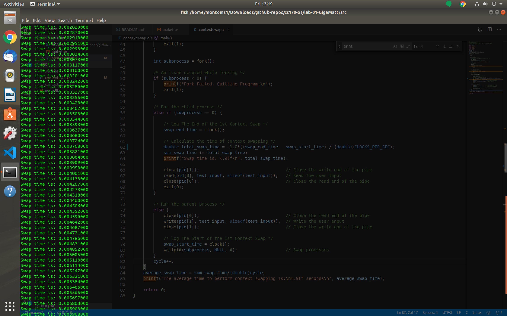

# CS 4375 - Operating Systems

## Lab 1 Report

### Overview

Lab 1: Due February 14, 2020 (1700 MDT)</br>
By: Matthew S Montoya</br>
ID: 88606727</br>
Instructor: Dr. Steven Roach</br>
TA: Aneesa Judd</br>

## Section 1: Introduction

In this lab, a program will further expand on the topic of context swapping, which has been introduced in lecture throughout the last four weeks. That is, a program will measure the time it takes to swap between two processes that are executed on a single CPU core. The objective for this lab is to measure the cost (time) it takes for the OS to perform context swapping, exploring this process by running experiments. This report details the findings. This report contains the following sections:

1. [Introduction](#section-1-introduction)
2. [Proposed Solution & Design Implementation](#section-2-proposed-solution-and-design-implementation)
3. [Experimental Results](#section-3-experimental-results)
4. [Discussion](#section-4-discussion)
5. [Appendix](#section-5-appendix)
6. [Academic Honesty](#section-6-academic-honesty)

## Section 2: Proposed Solution and Design Implementation

To achieve the end goal, it was reccomended by the instructor to follow the six-step guidance processes he provided in [[3](https://piazza.com/class_profile/get_resource/k55o7dya4ze1w3/k5ii23hksap61k)]. This process included:

1. Installing a Linux VM
2. Refamiliarizing myself with the C programming language by writing two programs that, through the terminal, read input and print output from a user, respecitvely
3. Writing a program that uses the ```fork()``` function to create a subprocess (also known as a _child process_) of an existing (or _parent_) process.
4. Extending Step 3's program to include the ```pipe()``` function which, according to Linux's man page is, "a unidirectional data channel that can be used for interprocess communication." [[1](#contributions-and-references)]
5. Conducting experiments using the ```gettimeofday()``` and/or ```clock()``` functions that will enable time measurement of certain processes in the code. For the purpose of this lab, the experiments should measure the precise time it takes to switch from one process (i.e. the parent process) to another (the child process).
6. Using what has been learned from the initial five (5) steps to solve the challange for this lab; that is measuring the average time it takes to do the context swap between two read and write processes in a pipe. This will be done by running the program several times, collecting enough data to analyze, calculate, and explain the variance in the output dataset.

### Initial Design Method(s)

My initial design implementation called for forking the program once, using two pipes in the process. This design method was derived from the ```pipe()``` tutorial by [[2](#contributions-and-references)]. In the tutorial, it was noted that connecting one process to another could involve the use of two pipes; one pipe to write from the user input (process one) to a pipe and read from the pipe to the second process (user output), and a second pipe to redo this process from the second process to the first process. An issue with this initial design was my misinterpretation of the term _process_.

In designing the initial implementation, I understood _process_ to be the execution of an external program (i.e. ```read_input.c```). This lead to a design where two pipes would execute external ```read_input.c``` and ```write_output.c``` programs through the ```execlp``` command. This conflicted with step 2 in the [six-step process](#section-1-introduction) described above, as these programs transformed from function calls to executable programs with their own ```main()``` functions. This misinterpreation existed for a week until I questioned why I was calling each external program twice (four (4) total external program calls) to perform the same computation, leading to inefficent, extra code in three (3) ```.c``` programs.

### Final Implementation Method

Because of the inefficiency of using two pipes to duplicate a single process, my next design implementation called for forking the program once, using one pipe in the process. This design was implemented by referencing the algorithm provided in slide 10 of [[3](https://piazza.com/class_profile/get_resource/k55o7dya4ze1w3/k5ii23hksap61k)] to understand how a single pipe could functionally serve to accomplish the end goals of this lab. After learning more about ```fork()``` and ```pipe()```, careful consideration was given to these functions wherein, should any of the two (2) function calls result in an error, the program would exit noting the error(s). The program runs 100 times to ensure there is enough data to calulate the mean and variance of the swap times.

## Section 3: Experimental Results

Parital output of the code (found in the [appendix](#section-5-appendix)) and the calculation of the variance is shown below. Note: Some images may include code (which can also be found in the Appendix section), due to terminal transparancy settings.

### Program Output

</br>
</br>

From the images above, we can see that with a population size of 100, we have a mean of 0.00324543 seconds and a variance of ~ 2.49*(10^-6) seconds.

## Section 4: Discussion

In this lab, a program expanded on the topic of context swapping, which has been introduced in lecture throughout the last four weeks. That is, a program measured the time it took to swap between two processes that are executed on a single CPU core. The objective for this lab is to measure the cost (time) it takes for the OS to perform context swapping, exploring this process by running experiments. This report details the findings.

Throughout this lab, I learned the logic of the ```fork()``` and ```pipe()``` functions, and how to properly implement them in the C language. This helped me learn and understand the concept of context swapping, as well as how to measure the average time and variance between the swaps. Despite minor output issues (negatives instead of positives, means equaling zero) on an Ubuntu VM, running the code on the UTEP CS154a _SystemsVM_ virtual machine counters some of these issues. Given the length of the test string (found in the [appendix](#section-5-appendix)), the resulting mean and variance (measured in seconds) match the output we did not expect. This results for the variance seem too large. However, when graphing the data, the times increase linearlly, with the measured time of the 100 context swaps being within milliseconds of each other on a single CPU core. This part is consistant with what we expect.

## Section 5: Appendix

### Student Code

```c
/*
 * CS 170 - Theory of Operating Systems
 * By: Matthew S Montoya
 * Purpose: Measure the time it takes for the OS to perform context swapping
 * Last Modified: 14 February 2020
*/
#define _GNU_SOURCE
#include <stdio.h>
#include <stdlib.h>
#include <sys/time.h>
#include <sys/wait.h>
#include <time.h>
#include <unistd.h>
#include <sched.h>

#define MAX 300
__clock_t swap_start_time, swap_end_time;
int cycle;
double average_swap_time, variance, sum_swap_time;

/* Runner executes the program */
int main() {

    cycle = 0;
    sum_swap_time = 0.0;

    /* Loop Experiment 100 times */
    while(cycle < 100){
        /* Ensure Context-Switching Processes are located on CPU Core 0 */
        cpu_set_t set;
        CPU_ZERO(&set);
        CPU_SET(0, &set);
        sched_setaffinity(0,sizeof(cpu_set_t), &set);

        char *test_input = "I pray that I graduate this semester.";

        /* Create Pipe */
        int pid[2];
        pipe(pid);

        /* An issue occured while piping */
        if(pid < 0){
            printf("Pipe Failed. Quitting Program.\n");
            exit(1);
        }

        int subprocess = fork();

        /* An issue occured while forking */
        if (subprocess < 0) {
            printf("Fork Failed. Quitting Program.\n");
            exit(1);
        }

        /* Run the child process */
        else if (subprocess == 0) {

            /* Log The End of the 1st Context Swap */
            swap_end_time = clock();

            /* Calculate the time of context swapping */
            double total_swap_time = (swap_end_time - swap_start_time) / (double)CLOCKS_PER_SEC;
            sum_swap_time += total_swap_time;
            printf("Swap time is: %.9lf\n", total_swap_time);

            close(pid[1]);                                  // Close the write end of the pipe
            read(pid[0], test_input, sizeof(test_input));   // Read the user input
            close(pid[0]);                                  // Close the read end of the pipe
            exit(0);
        }

        /* Run the parent process */
        else {
            close(pid[0]);                                  // Close the read end of the pipe
            write(pid[1], test_input, sizeof(test_input));  // Write the user enput
            close(pid[1]);                                  // Close the write end of the pipe

            /* Log The Start of the 1st Context Swap */
            swap_start_time = clock();
            waitpid(subprocess, NULL, 0);                   // Swap processes
        }
        cycle++;
    }
    average_swap_time = sum_swap_time/(double)cycle;
    printf("The average time to perform context swapping is:\n%.9lf seconds\n", average_swap_time);

    return 0;
}
```

## Section 6: Academic Honesty

### Contributions and References

1. (n.d.). Retrieved February 14, 2020, from http://man7.org/linux/man-pages/man2/pipe.2.html
2. Zhao-Liu M Q. Retrieved February 14, 2020, from https://www.youtube.com/watch?v=FcUlMsVX7aE
3. Roach, S. Retrieved February 14, 2020, from https://piazza.com/class_profile/get_resource/k55o7dya4ze1w3/k5ii23hksap61k
4. Roach, S. Retrieved February 14, 2020, from https://piazza.com/class/k55o7dya4ze1w3?cid=20
5. James, J. & Roach, S. Retrieved February 14, 2020, from https://piazza.com/class/k55o7dya4ze1w3?cid=24
6. Roach, S. & Vigilante, I. Retrieved February 14, 2020, from https://piazza.com/class/k55o7dya4ze1w3?cid=27
7. Anonymous & Roach, S. Retrieved February 14, 2020, from https://piazza.com/class/k55o7dya4ze1w3?cid=28

### Certification

On this day, February 14, 2020, I certify that this project is entirely my own work. I wrote, debugged, and tested the code being presented, performed the experiments, and wrote the report. I also certify that I did not share my code or report or provide inappropriate assistance to any student in the class. </br>
-_Matthew S Montoya_
